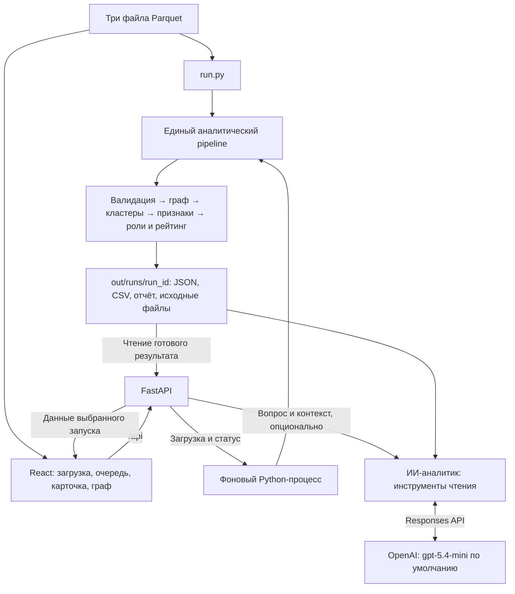

# Граф денег — HIBEKA

**Объяснимый анализ внутрибанковских переводов для AML-аналитика.** Проект
команды HIBEKA для HackAlem AI превращает граф переводов в очередь клиентов
для дополнительной проверки: показывает наблюдаемую роль каждого клиента,
его связи, основания приоритета и ограничения исходных данных.

Результат — гипотезы для аналитика, **не доказательство нарушения и не
вероятность мошенничества**.

## 1. Какую проблему решаем

В исходной выборке 81 клиент (seed), от которых собраны исходящие переводы
на четыре колена. Получившийся граф содержит 2 248 клиентов. Аналитику нужно
понять, кого изучать первым, как связаны участники и на чём основан вывод.

«Граф денег» объединяет проверку исходных файлов, расчёт сетевых признаков,
правила ролей, ранжирование и интерактивное изучение клиента. Решение
предназначено для специалиста финансового мониторинга, а не для
автоматического принятия санкционных решений.

## 2. Что реализовано

- **Загрузка и проверка трёх Parquet-файлов:** схемы, идентификаторы, суммы,
  даты, наличие клиентов и согласованность агрегированных связей с операциями.
- **Направленный граф:** входящие и исходящие суммы, число операций и
  контрагентов, PageRank, посредничество, достижимость от исходных клиентов.
- **Кластеризация Louvain:** группы клиентов, внутренний оборот, ведущие
  участники и объяснимая гипотеза о наблюдаемой структуре группы.
- **Шесть ролей:** сборщик (`consolidator`), распределитель (`distributor`),
  кандидат на транзит (`transit`), возможный конечный получатель (`terminal`),
  связующий узел (`coordinator`), периферийный/неопределённый (`peripheral`).
- **Рейтинг проверки:** пять факторов с сохранением исходных значений,
  нормализации, весов и вкладов в итоговый балл.
- **Рабочее место аналитика:** очередь с серверной пагинацией по 30 клиентов,
  точный поиск полного `gid`, фильтры роли, группы, seed и границы выборки.
- **Карточка клиента:** объяснения, показатели, предупреждения, таблицы
  отправителей и получателей, копирование точного `gid`.
- **Интерактивный локальный граф:** направление переводов, цвета ролей/групп,
  выбор клиента, сведения о связи, масштабирование и развёрнутый просмотр.
- **Фоновая обработка загрузок:** состояния выполнения, сообщения об ошибках,
  выбор готового анализа и скачивание трёх CSV.
- **Воспроизводимость:** снимок входов и конфигурации, контрольные суммы,
  версии библиотек, время этапов и сохранение предыдущего успешного результата.
- **Диагностика рейтинга:** сравнение с сортировкой по обороту и проверка
  чувствительности к весам.
- **ИИ-аналитик (опционально):** чат по выбранному анализу и клиенту,
  запросы к серверным данным, поиск связей между клиентами, просмотр операций
  по датам, источники ответа и переход к упомянутым клиентам. Нужен OpenAI API.

Основной интерфейс работает с реальным FastAPI. Оставшиеся в исходниках
mock-модули первого этапа не подключены к рабочему приложению; ошибка API
не заменяется демонстрационными данными.

## 3. Как работает решение

1. Пользователь запускает анализ локальных файлов или загружает три Parquet
   через интерфейс.
2. Сервер проверяет данные и строит направленный граф, сохраняя изолированных
   клиентов и встречные переводы.
3. Рассчитываются кластеры, признаки, роли и приоритеты по `config.json`.
4. Результат публикуется как отдельный завершённый запуск с собственным
   `run_id`.
5. Аналитик открывает очередь, ищет клиента, изучает карточку и переходит
   к контрагентам через таблицу или граф.
6. Для дальнейшей работы скачивает роли всех клиентов, группы и рейтинг.

При настроенном ИИ-аналитике можно задать вопрос обычным языком. Сервер
передаёт модели контекст выбранного анализа и выполняет только разрешённые
инструменты чтения. Модель формирует текстовый ответ; роли и приоритеты
по-прежнему рассчитывает локальный pipeline, а не LLM.

Выбранный клиент един для очереди, карточки и графа. При смене клиента
запросы отменяются, а ответы проверяются на соответствие текущему запуску
и клиенту. Выбор сохраняется при переходе между страницами. Изменение
фильтров сбрасывает страницу и выбирает первого клиента новой выдачи.

### Как формируется приоритет

При настройках по умолчанию:

```text
priority = 0.30 × P(посредничество)
         + 0.20 × P(PageRank)
         + 0.20 × P(входящая + исходящая сумма)
         + 0.15 × min(число достижимых upstream-seed / 3, 1)
         + 0.15 × P(число входящих + исходящих связей)
```

`P` — процентиль среди положительных значений у неизолированных клиентов.
У изолированных клиентов приоритет равен нулю. Роль и сила её признаков
не входят в формулу приоритета. Фильтры интерфейса не пересчитывают баллы.

Веса и пороги — экспертные правила, а не обученная модель. Подробные формулы,
порядок выбора ролей и ограничения: [методика анализа](docs/methodology.md).
Фактические примеры: [проверка рейтинга](docs/ranking_review.md).

## 4. Технологии

| Компонент       | Используемые технологии                                            |
| --------------- | ------------------------------------------------------------------ |
| Сервер          | Python, FastAPI, Uvicorn, Pydantic 2                               |
| Аналитика       | NetworkX: PageRank, betweenness, Louvain; NumPy, SciPy             |
| Данные          | PyArrow, Parquet; JSON-снимки и CSV-выгрузки                       |
| Интерфейс       | React 19, TypeScript, Vite 7, CSS                                  |
| Визуализация    | Cytoscape.js                                                       |
| Загрузка файлов | Multipart HTTP, python-multipart; отдельный Python-процесс расчёта |
| Проверки        | Python unittest, Node.js test runner, TypeScript, ESLint, Prettier |

Версии прямых зависимостей закреплены в [requirements.txt](requirements.txt)
и [frontend/package.json](frontend/package.json); для фронтенда сохранён
`package-lock.json`.

В панели чата Markdown-ответы отображаются через `react-markdown`.

**AI-модель:** в опциональном чате используется OpenAI Responses API через
Python SDK `openai`; модель по умолчанию в коде — `gpt-5.4-mini`, меняется
через `OPENAI_MODEL`. Настройки читаются через `python-dotenv` и переменные
окружения. Собственная модель на датасете не обучается.

Ассистент использует function calling: приложение исполняет разрешённые
запросы к данным и передаёт результаты модели. Описание механизма:
[официальная документация OpenAI](https://developers.openai.com/api/docs/guides/function-calling).

Основной анализ, граф, очередь и CSV после установки зависимостей работают
локально, без API-ключа, GPU и внешних банковских сервисов. **Только чат**
требует интернет, ключ и доступную квоту OpenAI API; он передаёт данные
внешнему сервису. Его доступность не является условием расчёта рейтинга.

## 5. Архитектура проекта



```text
backend/app/
  main.py           FastAPI и диагностические методы
  runs.py           Загрузка, готовые запуски, карточки, граф и CSV
  jobs.py           Управление фоновым процессом и его состоянием
  worker.py         Точка входа фонового расчёта
  validation.py     Проверки Parquet и согласованности данных
  local_graph.py    Локальное окружение выбранного клиента
  assistant.py      OpenAI-чат, конфигурация, ограничения и ошибки
  assistant_tools.py  Инструменты чтения и поиска путей для ИИ
  analytics/        Граф, кластеры, признаки, роли, рейтинг, pipeline
backend/tests/      Проверки аналитики, данных и HTTP-загрузок
frontend/src/
  App.tsx           Рабочее место аналитика
  api/client.ts     Типизированный HTTP-адаптер
  state/review.ts   Выбор клиента, поиск, фильтры и пагинация
  hooks/            Загрузка ресурсов и защита от устаревших ответов
  components/       Карточка, граф, загрузка и другие элементы интерфейса
frontend/tests/     Проверки состояния, адаптеров и утилит
data/               Предоставленные три Parquet-файла
docs/               Методика и разбор рейтинга
starter/            Исходная заготовка организаторов
config.json         Версии, пороги и веса аналитики
run.py              Полный анализ одной командой
out/                Создаваемые результаты; не включены в Git
```

CLI и загрузка через API используют один pipeline. Готовые результаты
читаются из снимка, без повторного расчёта центральностей при открытии
карточки. База данных и отдельный брокер задач не используются.

## 6. Установка и запуск

### Требования

- Python **3.12 или новее**; локально проверено на Python 3.12.14.
- Node.js **22.13+ из ветки 22** или **24+**, npm.
- Для приведённых команд — macOS/Linux и терминал.
- Свободные порты `8000` для API и `5173` для интерфейса.

**Python 3.9 не подходит.** Команда `python3` на компьютере может запускать
именно его. После создания окружения ниже используется явный путь
`.venv/bin/python`, поэтому активация в каждом новом терминале не требуется.

### Шаг 1. Получить проект

```bash
git clone https://github.com/BAITC-Hacks/hack-119e9d43-hibeka.git
cd hack-119e9d43-hibeka
```

Если проект уже скачан, откройте его корневую папку. Все следующие команды
выполняются из неё.

### Шаг 2. Установить зависимости

```bash
python3.12 --version
node --version
npm --version
python3.12 -m venv .venv
.venv/bin/python -m pip install -r requirements.txt
npm --prefix frontend ci
```

Если команда `python3.12` отсутствует, сначала установите Python 3.12+ или
укажите команду уже установленной подходящей версии. Если корректная
`.venv` уже создана, повторно создавать её не нужно.
После получения обновлений повторите установку зависимостей: новые модули
`openai`, `python-dotenv` и `react-markdown` должны присутствовать локально,
даже если вы не включаете чат.

### Шаг 3. Выполнить полный анализ

```bash
.venv/bin/python run.py --data ./data --out ./out --config ./config.json
```

Команда печатает идентификатор запуска, количество клиентов, кластеров и
время расчёта. Создаются три обязательных файла:

| Файл                  | Содержимое                                                                    |
| --------------------- | ----------------------------------------------------------------------------- |
| `out/nodes_roles.csv` | Все клиенты: `gid, role, role_score, cluster_id, priority_score, evidence`    |
| `out/clusters.csv`    | Группы: `cluster_id, n_nodes, n_seed, sum_kzt_internal, top_gids, hypothesis` |
| `out/top_nodes.csv`   | Рейтинг: `rank, gid, role, priority_score, why`                               |

По умолчанию выгружаются первые 50 клиентов. Для топ-20 добавьте
`--top-n 20`; минимально допустимое значение — 20. Если клиентов меньше,
выгружаются все с предупреждением.

Для предоставленных данных ожидаются **2 248 клиентов и 91 кластер** при
текущей конфигурации. CSV используют UTF-8 и запятую; при открытии в
табличном редакторе импортируйте `gid` как **текст**, иначе возможна потеря
точности длинного идентификатора.

### Шаг 4. Запустить API — первый терминал

```bash
.venv/bin/python -m uvicorn backend.app.main:app --host 127.0.0.1 --port 8000
```

Сервер остаётся работающим. Проверка из другого терминала:

```bash
curl http://127.0.0.1:8000/api/health
```

Ожидаемый ответ: `{"status":"ok"}`.
Интерактивная документация API: [Swagger UI](http://127.0.0.1:8000/docs).

### Шаг 5. Запустить интерфейс — второй терминал

Из корня того же проекта:

```bash
npm --prefix frontend run dev
```

Откройте [интерфейс](http://127.0.0.1:5173). Vite проксирует `/api` на
`127.0.0.1:8000`. Приложение автоматически открывает последний завершённый
анализ. Если шаг 3 пропущен, можно загрузить три файла через интерфейс.

Для остановки нажмите `Ctrl+C` в терминале соответствующего сервера.
Подробности интерфейса: [frontend/README.md](frontend/README.md).

### ИИ-аналитик — необязательная настройка

Основной сценарий работает без ключа. Чтобы включить чат, создайте `.env`
в корне проекта по шаблону [.env.example](.env.example). Если файл уже есть,
добавьте недостающие настройки, не перезаписывая другие значения:

```dotenv
OPENAI_API_KEY=ваш_серверный_ключ
OPENAI_MODEL=gpt-5.4-mini
```

Ключ хранится только на сервере: не добавляйте его в Git, сообщения чата
или переменные `VITE_*`. Переменные окружения имеют приоритет над `.env`.
Сервер читает настройки при запросе; после добавления ключа нажмите
«Обновить статус» в панели. Наличие ключа в статусе не подтверждает его
валидность, доступ к модели или наличие квоты.

Без ключа чат показывает инструкцию подключения. Ошибки авторизации,
квоты, соединения и времени ожидания отображаются отдельно. Реальный
ответ требует доступной модели и средств/квоты соответствующего API-проекта.

**Передача данных:** при вопросе в OpenAI отправляются текст вопроса,
часть истории, контекст анализа и результаты запрошенных инструментов,
в том числе идентификаторы, суммы, связи и даты. Используйте чат только
если такая передача разрешена для ваших данных. Параметр `store=False`
в запросе не делает обработку локальной.

### Сборка интерфейса

```bash
npm --prefix frontend run build
npm --prefix frontend run preview
```

Сборка проверяет TypeScript и создаёт `frontend/dist`. Локальный просмотр
доступен на [порту 4173](http://127.0.0.1:4173); API должен продолжать работать.

### Если что-то не запускается

| Симптом                                     | Что проверить                                                                                                     |
| ------------------------------------------- | ----------------------------------------------------------------------------------------------------------------- |
| `python: command not found`                 | Используйте `.venv/bin/python` либо активируйте окружение: `source .venv/bin/activate`                            |
| Ошибка `int \| float` или `model_validator` | Версию `.venv/bin/python --version` и установку зависимостей именно в эту среду; системный Python 3.9 не подходит |
| Нет готовых анализов                        | Выполните шаг 3 или загрузите все три файла через интерфейс                                                       |
| API недоступен или возвращает HTML          | Запущен ли FastAPI на порту 8000; после изменения Vite-конфигурации перезапустите фронтенд                        |
| После обновления не найден Cytoscape        | Повторите `npm --prefix frontend ci`                                                                              |
| HTTP 409 при новом анализе                  | Дождитесь завершения текущего расчёта; одновременно доступен один слот                                            |

## 7. Как проверить решение

### Сценарий для жюри

После установки и запуска:

1. Убедитесь, что сводка показывает 2 248 клиентов, 3 119 связей и 4 840
   переводов за июль 2026.
2. Перейдите на следующую страницу очереди, примените фильтр роли или группы,
   затем сбросьте его.
3. Введите полный `gid` **100000004403675100** и нажмите Enter. При текущих
   данных и настройках это 19-е место, роль `coordinator`, входящие
   182 980 ₸ и исходящие 264 699 ₸. Посмотрите основания приоритета и связи:
   этот клиент не входит в топ-20 простой сортировки по обороту.
4. Выберите контрагента в таблице или узел графа. Убедитесь, что карточка
   и окружение относятся к новому выбранному клиенту.
5. Найдите **100000000018102100**. У клиента нет исходящих, но он находится
   на границе четвёртого колена: система предупреждает о неполноте наблюдения,
   а не уверенно объявляет его конечным получателем.
6. Скопируйте `gid`, скачайте три CSV через меню «Скачать CSV».
7. Загрузите файлы из `data/` как новый анализ, дождитесь завершения и
   убедитесь, что появился отдельный запуск.
8. Если OpenAI настроен и передача данных разрешена, откройте ИИ-аналитика
   и спросите: «Объясни роль выбранного клиента». Сверьте ответ и источники
   с карточкой. Без ключа проверьте сообщение о необходимости подключения.

Эти идентификаторы — примеры из предоставленного датасета, не специальные
ветки алгоритма. Для любого другого клиента можно проверить фактические
значения и правила в карточке и результатах анализа.

### Автоматические проверки

Из корня проекта:

```bash
.venv/bin/python -m unittest discover -s backend/tests -v
npm --prefix frontend run typecheck
npm --prefix frontend run lint
npm --prefix frontend run format:check
npm --prefix frontend test
npm --prefix frontend run build
```

Серверные тесты проверяют валидацию, графовые показатели, роли, экспорт,
воспроизводимость, реальные HTTP-загрузки, статусы и сбои фоновых процессов.
HTTP-тестам нужен доступ к свободному локальному порту. Проверки используют
временные папки и не изменяют предоставленные исходные данные.

Фронтенд-тесты проверяют состояние выбора, пагинацию, фильтры, запоздавшие
ответы, HTTP-адаптер, точность идентификаторов, форматирование и копирование.
Часть тестов относится к сохранённому mock-слою первого этапа. Отдельного
компонентного или end-to-end-фреймворка в проекте нет.
Эти тесты не подтверждают качество или доступность ответов внешней LLM;
живой запрос к OpenAI проверяется отдельно и расходует API-квоту.

### Где смотреть основания и воспроизводимость

В `out/runs/<run_id>/` сохраняются:

- `inputs/` и `config.json` — исходные файлы и применённые параметры;
- `analysis.json` — признаки, кандидатные роли, объяснения и связи;
- `run_report.json` — статус, сводка, предупреждения, SHA-256 входов,
  конфигурации и CSV, версии библиотек, длительности этапов;
- `role_diagnostics.json` — диагностика ролей;
- `ranking_review.md`, `ranking_sensitivity.json` — сравнение с оборотом,
  десять изменений весов на ±20% и пять исключений отдельных факторов;
- три обязательных CSV.

`out/latest` указывает на последний успешный снимок. При одинаковых входах,
конфигурации, коде и среде CSV воспроизводимы; время и идентификатор запуска
меняются. Ошибка нового расчёта не подменяет предыдущий успешный результат.
CLI возвращает код 1 и сохраняет диагностику в `out/failed/`.

## 8. Данные и интеграции

### Входной набор

В репозитории находятся предоставленные для кейса файлы:

| Файл                        | Одна строка                      | Обязательные столбцы             |
| --------------------------- | -------------------------------- | -------------------------------- |
| `data/nodes.parquet`        | Клиент                           | `gid, depth, is_seed`            |
| `data/edges.parquet`        | Агрегированная направленная пара | `src, dst, sum_kzt, n_tx, depth` |
| `data/transactions.parquet` | Отдельная операция               | `src, dst, date, sum_kzt`        |

Параметры выборки: 81 seed, 1–31 июля 2026 года, четыре колена по исходящим
переводам, порог 5 000 KZT. Итог: 2 248 клиентов, 3 119 направленных пар,
4 840 операций. Общее число клиентов не зашито в алгоритм.

Суммы при проверке агрегируются в целых тиынах; допустимое расхождение суммы
пары — 0,01 KZT. Одинаковые строки операций сохраняются: без
`transaction_id` нельзя утверждать, что это ошибочные дубликаты.
`gid` хранится как целое число в Python и как строка в JSON/браузере.

### API приложения

| Метод                                       | Назначение                            |
| ------------------------------------------- | ------------------------------------- |
| `GET /api/health`                           | Доступность сервера                   |
| `GET /api/runs`                             | Список запусков                       |
| `POST /api/runs`                            | Загрузка трёх файлов и запуск анализа |
| `GET /api/runs/{run_id}`                    | Статус, сводка и отчёт                |
| `GET /api/runs/{run_id}/nodes`              | Очередь с фильтрами и пагинацией      |
| `GET /api/runs/{run_id}/nodes/{gid}`        | Карточка и контрагенты                |
| `GET /api/runs/{run_id}/graph?gid={gid}`    | Локальный направленный граф           |
| `GET /api/runs/{run_id}/clusters`           | Группы готового анализа               |
| `GET /api/runs/{run_id}/exports/{filename}` | Один из трёх обязательных CSV         |

Параметры очереди: `offset`, `limit` (1–500), `role`, `cluster_id`,
`is_seed`, `truncated_by_depth`, `min_priority` (0–1).
Поиск интерфейса — точный запрос карточки по полному `gid`, а не поиск
по имени или подстроке. Граф поддерживает `hops=1`, `limit=1..150`;
ограничение отображения не сокращает таблицы контрагентов.

Загрузка через API, альтернативная форме интерфейса:

```bash
curl -X POST http://127.0.0.1:8000/api/runs \
  -F 'nodes=@data/nodes.parquet' \
  -F 'edges=@data/edges.parquet' \
  -F 'transactions=@data/transactions.parquet'
```

Сервер возвращает HTTP 202 с `run_id`. Статусы:
`queued → running → completed` либо `failed`. Состояние запрашивается
через `GET /api/runs/{run_id}`; при ошибке расчёта причина находится в
`error.message`. Лимит сохраняемого файла — 128 MiB. Занятый слот даёт
409, превышение лимита — 413, некорректный запрос — 422. Ошибки содержимого
Parquet обнаруживаются во время фонового расчёта.

Дополнительно есть диагностические `/api/data/summary`,
`/api/graph/summary`, `/api/clients/metrics` и `/api/clusters`.
Они пересчитывают данные папки `data/` при запросе, а не читают выбранный
снимок загруженного анализа.

### Инструменты ИИ-аналитика

- `GET /api/assistant/status` — наличие настройки и выбранная модель.
- `POST /api/runs/{run_id}/assistant` — вопрос `message`, необязательный
  `selected_gid` и история `history`. Ответ содержит `answer`, `sources`,
  `client_ids`, модель и число обращений к инструментам.

Доступны семь инструментов только для чтения: `get_overview`, `list_clients`,
`get_client`, `get_counterparties`, `get_clusters`, `find_connection`,
`get_transactions`. Поиск пути ограничен шестью шагами и может учитывать
направление; операции фильтруются по датам. Источники формируются сервером,
а переходы к клиентам разрешаются для идентификаторов из полученных данных.
Это не автоматическая проверка истинности каждой фразы ответа модели.

Сервер ограничивает вопрос 4 000 символами, историю 12 сообщениями,
исследование 10 вызовами инструментов и шестью раундами; общее ожидание —
120 секунд. Одновременно допускается до двух запросов на процесс сервера.
Инструменты не изменяют файлы, роли, оценки или настройки анализа.

По умолчанию API читает результаты из `out/`. Для другой папки задайте
`GRAPH_OUTPUT_DIR` перед запуском сервера и используйте ту же папку в
CLI-параметре `--out`. Внешних источников персональных данных нет.

## 9. Ограничения текущей версии

- **Неполное наблюдение.** Входящие seed могут отсутствовать; за четвёртым
  коленом продолжение потока не видно. Разность входа и выхода не является
  остатком на счёте.
- **Нет подтверждённых меток нарушений.** Accuracy, precision и recall
  не оценивались. Проверка устойчивости не доказывает качество выявления.
- **Роли — гипотезы.** `coordinator` не означает доказанного организатора,
  `peripheral` — отсутствие риска. Назначение `transit` не подтверждает
  быстрый перевод тех же средств.
- **LLM может ошибаться.** Ссылки на источники и доступ только к чтению
  не гарантируют правильность текста. Нет отдельной оценки качества
  ассистента или автоматической верификации каждого утверждения.
  Без сети, подходящего ключа и API-квоты чат недоступен; остальной анализ
  остаётся локальным.
- **Временной анализ ограничен.** Учитываются даты первого входа и
  длительность наблюдения; поиска транзита за 1–2 дня, временной шкалы,
  автоматического анализа циклов и прослеживания конкретных денег нет.
- **Масштаб ограничен текущей реализацией.** Граф и JSON находятся в памяти,
  посредничество рассчитывается точно. Работа на миллионе узлов не проверена;
  необходимые изменения описаны в [методике](docs/methodology.md#масштабирование).
- **Локальный граф, не вся сеть.** API показывает окружение в один шаг,
  максимум 150 узлов; интерфейс первоначально ограничивает число контрагентов.
- **Нет постоянного пользовательского состояния.** Клиент, фильтры и страница
  не сохраняются в URL; обновление страницы не восстанавливает выбранную карточку.
  Нет заметок, статусов расследования и совместной работы аналитиков.
- **Один расчёт на папку результатов.** После жёсткого прерывания процесса
  возможна оставшаяся `.analysis.lock`; автоматическое восстановление
  не реализовано. Перед ручной очисткой нужно убедиться, что расчёт завершён,
  и сохранить диагностику. Логи API-задач: `out/jobs/<run_id>/worker.log`.
- **Не промышленный банковский сервис.** Нет аутентификации, разграничения
  доступа и аудита действий пользователей; публичное размещение требует
  дополнительной защиты. Публикация снимков использует символические ссылки;
  инструкция рассчитана на macOS/Linux.

## 10. Развёрнутая версия

**Подтверждённая ссылка на публично развёрнутую версию в репозитории
не указана.** Адреса `127.0.0.1` выше — только локальный запуск.

Для размещения собранного интерфейса нужен сервер, раздающий
`frontend/dist` и проксирующий `/api` в FastAPI. Статический хостинг
без работающего API недостаточен. Автоматическая конфигурация развёртывания
в текущем репозитории не предоставлена.
